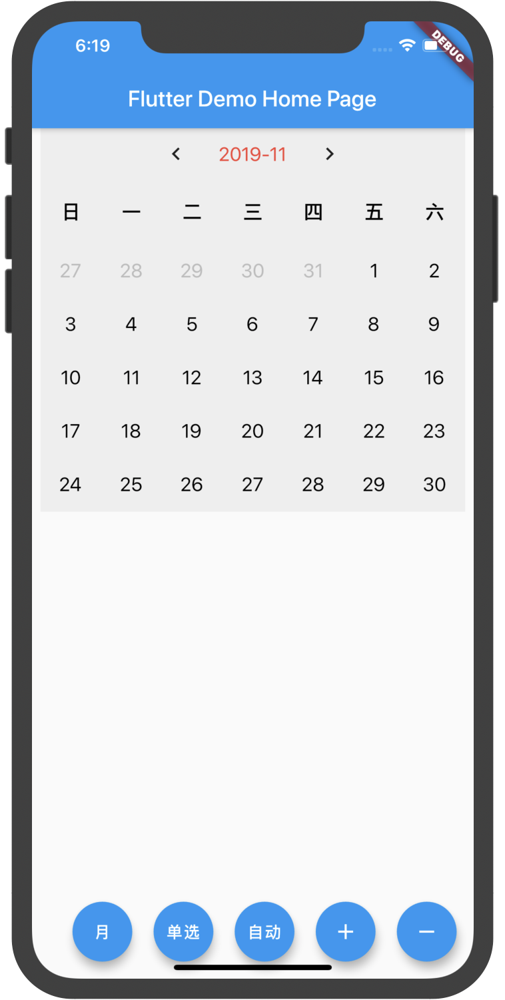
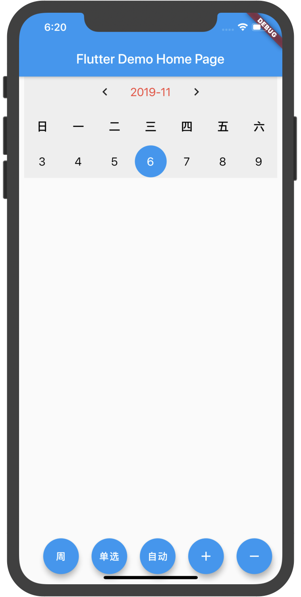
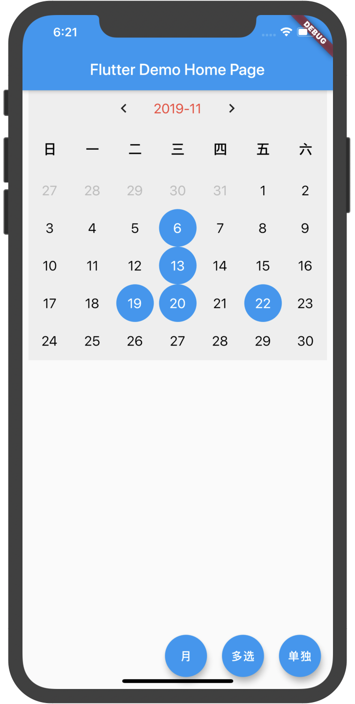
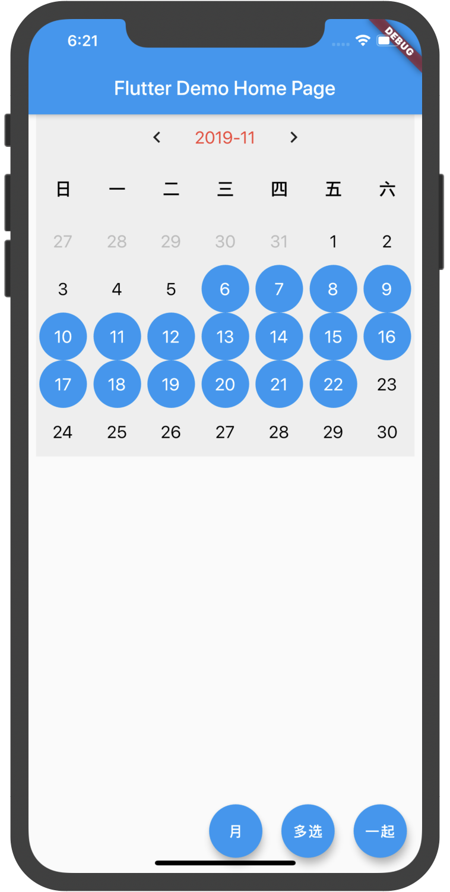

# r_calendar

📅📆Flutter日历插件，支持自定义日历，月视图/周视图切花、点击拦截、单选（切换月自动选）、多选（散选/聚选）

- [✔] 月视图/周视图切换
- [✔] 自定义日历
- [✔] 点击拦截
- [✔] 单选，切换月/周自动选
- [✔] 多选,散选/聚选

|  <b>单选</b> |  <b>周视图</b> |  <b>多选</b> |  <b>多选</b> |
| :---: | :---: | :---: | :---: |

